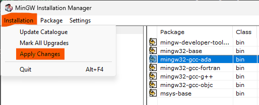
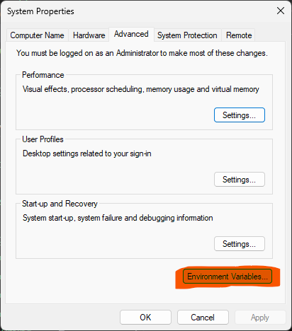
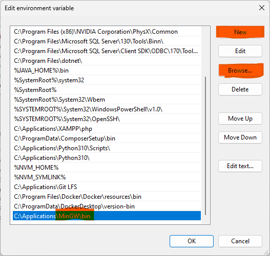
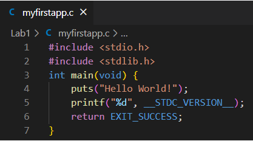
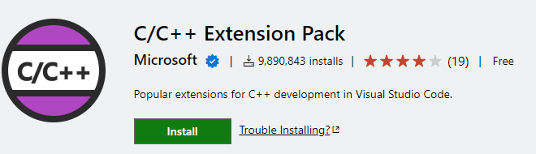
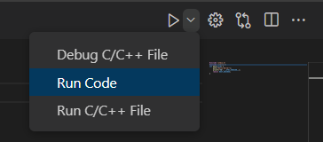
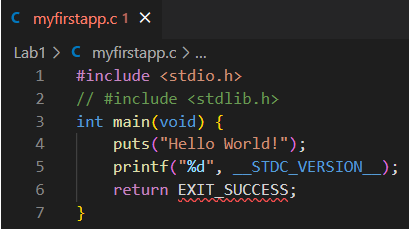

# PPWJC 
Lab 1 

## Pytania 
- Znajdź i wypisz wersje standardu języka C. 
- Czym jest kompilator? 
- Opisz czym jest IDE (Zintegrowane środowisko programistyczne). W jaki sposób ułatwia pracę programisty? 
- Wymień konwencje nazewnictwa zmiennych w programowaniu i podaj przykłady. 

## Zadania (opis dla systemów Windows): 

- Zainstalować [Visual Studio Code](https://code.visualstudio.com) 
- Zainstalować kompilator języka C. Np. Pakiet [MinGW](https://sourceforge.net/projects/mingw/) zawierający kompilator GCC dla Windows. 
:warning: Zwróć uwagę na lokalizację zainstalowania pakietu. Będzie ona potrzebna przy kolejnych krokach. 

- Podczas instalacji w jednym z kroków należy zaznaczyć pakiety które chcemy zainstalować.(wszystkie)

- Po wybraniu pakietów należy kliknąć **installation > Apply Changes** i potwierdzić wybór.

- Aby mieć dostęp do narzędzia GCC z terminala cmd lub powershell ścieżka do pliku musi znajdować się w zmiennych systemowych. Sprawdź, czy polecenie jest dostępne wpisując w terminalu `gcc`. **Jeśli w terminalu pojawia się następujący komunikat pomiń następny krok.** 

- Jeśli polecenie gcc nie jest dostępne w menu start znajdź opcję "edit the system enviroment variables" lub w polskiej wersji systemu "edytuj zmienne środowiskowe".  

    - W kolejnym oknie wybierz "Enviroment Variables" lub "Zmienne środowiskowe" (przycisk powinien znajdować się w tym samym miejscu niezależnie od wersji systemu Windows)
    
    - Odszukaj zmieną Path i wciśnij edit.
     
    - W oknie edit kliknij **New** a potem **Browse** i znajdź lokalizację pliku gcc.exe (folder bin w folderze, gdzie został zainstalowany MinGW). Przykładowo, jeśli MinGW został zainstalowany w lokalizacji C:\Applications\MinGW wpis do Path powinien wyglądać następująco
    
    - Potwierdź wciskając ok i ponownie przetestuj polecenie gcc w terminalu CMD lub PowerShell. Powinien pojawić się następujący komunikat  
    
- Utworzyć folder ze swoimi inicjałami oraz numerem albumu na pulpicie a w nim folder lab1. Uruchomić Visual Studio Code a następnie otworzyć utworzony folder lab1. 
- Utwórz plik myfirstapp.c (pliki źródłowe aplikacji, które wymagają kompilacji mają sufix .c [[1]](https://gcc.gnu.org/onlinedocs/gcc/Overall-Options.html) [[2]](https://www.doc.ic.ac.uk/lab/cplus/cstyle.html#N10081)) 
- W utworzonym pliku napisz swój pierwszy program wypisujący napis `Hello World!` Oraz wersję standardu języka c użytego przy kompilacji. 

- Zapisz plik, uruchom terminal, a następnie skompiluj program poleceniem `gcc ścieżka_do_programu –o nazwa_pliku_wykonywalnego` [[1]](https://gcc.gnu.org/onlinedocs/gcc/Overall-Options.html)
- Uruchom skompilowany program wpisując jego nazwę w terminalu. Uruchom program drugim sposobem dwukrotnie klikając w plik. 

***

- Visual Studio Code jest narzędziem które możemy konfigurować wedle swoich potrzeb dzięki pluginom. Zainstaluj C/C++ Extension Pack. Jedną z jego funkcjonalności jest kolorowanie składni. 

- Skompiluj i uruchom program korzystając z IDE Visual Studio Code dzięki zainstalowanym pluginom. Mając wybraną zakładkę z twoim programem znajdź następującą opcję:

- Zmodyfikuj program "zakomentowując" deklarację biblioteki stdlib.h (linie zaczynające się od znaków "//" są komentarzami nie mającymmi wpływu na działanie kodu. Kompilator je pomija).  

- Uruchom program i znajdź miejsce, w którym jest opisany błąd występujący w programie. 

## Po zakończonej pracy:
1. Zapisz swoje rezultaty
2. Usuń utworzone pliki z pulpitu


```html
<!DOCTYPE html>
<html lang="en">
<head>
    <meta charset="UTF-8">
    <meta http-equiv="X-UA-Compatible" content="IE=edge">
    <meta name="viewport" content="width=device-width, initial-scale=1.0">
    <title>Main view</title>
</head>
<body>
   {{{body}}}
</body>
</html>
```