# Programowanie w Języku C. Lab. 1

## Pierwszy program

Aby utworzyć nowy projekt w Visual Studio Code należy utworzyć nowy folder który będzie zawierał wszystkie pliki projektu. Można to zrobić na wiele sposobów. Jednym z nich jest stworzenie folderu na pulpicie, kliknięcie prawym przyciskiem myszy na folder i wybranie z menu kontekstowego opcji `open with code`.


Po otwarciu ukaże się interfejs programu.
- Kolorem zielonym oznaczono drzewo projektu. U góry(po najechaniu na pasek z nazwą) dostępne są opcje utworzenia nowego folderu wewnątrz projektu a także plików. 
- Kolorem czerwonym oznaczono zakładkę umożliwiającą zainstalowanie rozszerzeń(pluginów) do programu.
- Kolorem żółtym opcję menu umożliwiającą otworzenie nowego terminala. **Tworząc nowy terminal z otwartym projektem(folderem) domyślnie będzie on otwarty w katalogu głównym projektu.** Jeśli nie jest należy za pomocą komendy `cd` (system windows) przejść do katalogu z którego pliki będziemy kompilować lub uruchamiać.

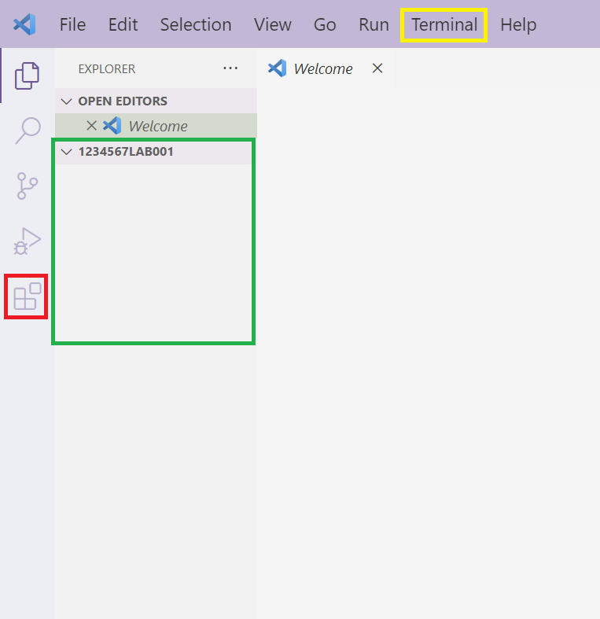

 Zwykle pliki źródłowe zawierające kod programu w języku C mają rozszerzenie ".c". Na przykład, "main.c", "utils.c", "mylibrary.c". Przy wybieraniu nazwy dla plików:
 - **unikaj używania spacji i znaków specjalnych w nazwach plików i katalogów**, ponieważ mogą one powodować problemy w niektórych narzędziach i systemach operacyjnych.
 - **stosuj opisowe i zrozumiałe nazwy plików, które odzwierciedlają ich zawartość i przeznaczenie**. To ułatwi pracę z projektem innym programistom.

 Aby utworzyć plik ze wspomnianego wcześniej menu znajdującego się w drzewie katalogu wybierz ikonkę kartki ze znakiem "+". Następnie wpisz nazwę pliku(pamiętaj o rozszerzeniu pliku - ".c") i zatwierdź wciskając enter.
 
 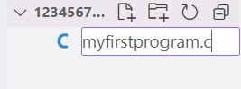

 Wyspecjalizowane pluginy ułatwiają pracę programisty. Poniżej lista przykładowych pluginów:

- Material Icon Theme zawiera ikony dla wielu języków programowania, frameworków i typów plików, co ułatwia rozpoznawanie zawartości projektu. Możesz dostosować ten plugin do swoich potrzeb, wybierając różne zestawy ikon i konfigurując ich wygląd.

 

 - C/C++ Extension Pack to zestaw rozszerzeń dla środowiska Visual Studio Code (VS Code). Oferuje narzędzia takie jak IntelliSense(sugesttie kodu, dokumentacja, **sprawdzanie poprawności składni**), debugowanie(narzędzie do analizy kodu w celu wyszukiwania błędów tzw. "bugów") itp.

 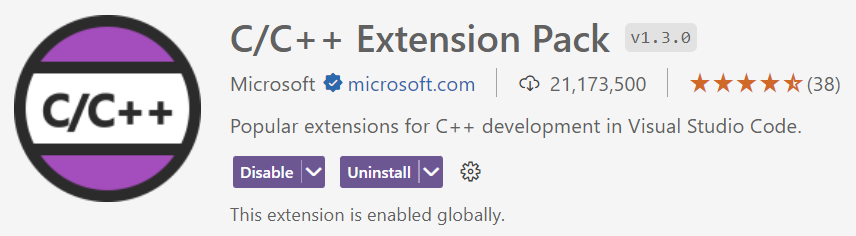

### Zadanie 1

 Utworzyć nowy projekt o nazwie [nr. albumu]LAB001. W projekcie utworzyć plik `myfirstapp.c` z następującą zawartością:

 ```c
#include <stdio.h>
#include <stdlib.h>

int main()
{
    printf("Hello, World!\n");
    system("PAUSE");
    return EXIT_SUCCESS;
}
 ```

## Kompilacja

Kompilacja w języku C to proces przekształcania kodu źródłowego napisanego w języku C na kod maszynowy lub plik wykonywalny, który może być uruchomiony na komputerze. Popularnym narzędziem do kompilacji plików w języku C jest program MinGW zawierający implementację GCC(GNU Compiler Collection - darmowy i otwarty kompilator). 

[**MinGW Download**](https://sourceforge.net/projects/mingw/)

**Konfiguracja MinGW dla systemów Windows:** 

- Zainstalować kompilator języka C. Np. Pakiet [MinGW](https://sourceforge.net/projects/mingw/) zawierający kompilator GCC dla Windows. 
:warning: Zwróć uwagę na lokalizację zainstalowania pakietu. Będzie ona potrzebna przy kolejnych krokach.
<br>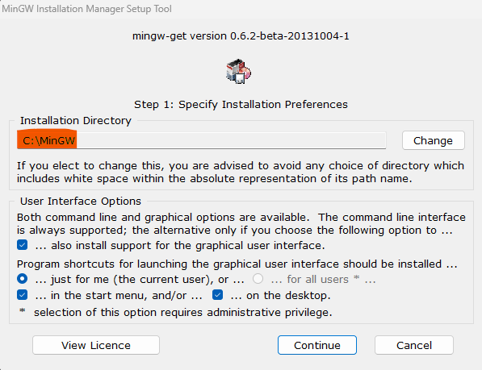
- Podczas instalacji w jednym z kroków należy zaznaczyć pakiety które chcemy zainstalować.(wszystkie)
<br>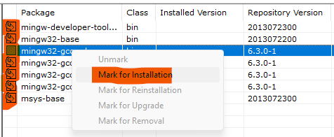
- Po wybraniu pakietów należy kliknąć **installation > Apply Changes** i potwierdzić wybór.
<br>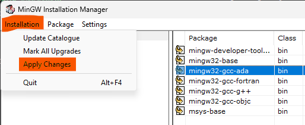
- Aby mieć dostęp do narzędzia GCC z terminala cmd lub powershell ścieżka do pliku musi znajdować się w zmiennych systemowych. Sprawdź, czy polecenie jest dostępne wpisując w terminalu `gcc`. **Jeśli w terminalu pojawia się następujący komunikat pomiń następny krok.** 
<br>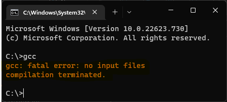
- Jeśli polecenie gcc nie jest dostępne w menu start znajdź opcję "edit the system enviroment variables" lub w polskiej wersji systemu "edytuj zmienne środowiskowe".  
<br>
    - W kolejnym oknie wybierz "Enviroment Variables" lub "Zmienne środowiskowe" (przycisk powinien znajdować się w tym samym miejscu niezależnie od wersji systemu Windows)
    <br>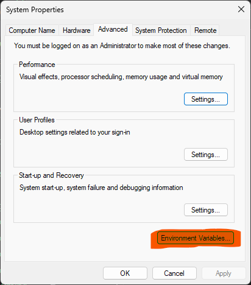
    - Odszukaj zmieną Path i wciśnij edit.
    <br>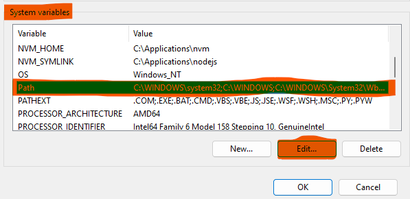 
    - W oknie edit kliknij **New** a potem **Browse** i znajdź lokalizację pliku gcc.exe (folder bin w folderze, gdzie został zainstalowany MinGW). Przykładowo, jeśli MinGW został zainstalowany w lokalizacji C:\Applications\MinGW wpis do Path powinien wyglądać następująco
    <br>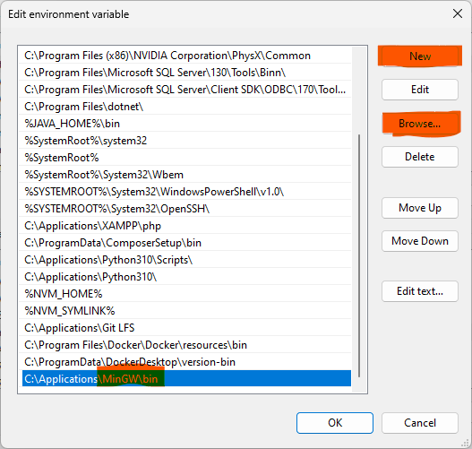
    - Potwierdź wciskając ok i ponownie przetestuj polecenie gcc w terminalu CMD lub PowerShell. Powinien pojawić się następujący komunikat  
    <br>

Po zainstalowaniu i konfiguracji można użyć narzędzia do kompilacji. W tym celu należy uruchomić konsolę systemu, przejść do folderu w którym znajduje się program a następnie wywołać polecenie: `gcc [ścieżka do pliku]`. Po wykonaniu polecenia w folderze gdzie został uruchomiony terminal powinien pojawić się plik wykonywalny `a.exe`.

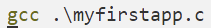

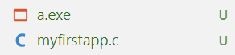

Jeśli chcemy skompilować plik i nadać mu własną nazwę w narzędziu do kompilacji należy zdefiniować flagę `-o` po której podajemy nazwę pliku wyjściowego `gcc [ścieżka do pliku].c -o [ścieżka do pliku wyjściowego].exe`(.exe dla systemu windows).

Kompilator jest w stanie wychwycić niektóre z błędów np.:
- Błędy składniowe: To najbardziej podstawowe błędy, takie jak niezamknięte nawiasy, brak średników na końcu instrukcji, nieprawidłowe nazwy zmiennych czy funkcji
- Błędy semantyczne: To błędy związane z niewłaściwym wykorzystaniem języka. Mogą obejmować próby operacji na zmiennych o niewłaściwym typie danych, wywoływanie nieistniejących funkcji, błędy zasięgu zmiennych itp.

Pierwszy napotkany problem przy kompilacji zostanie zazwyczaj wypisany jako komunikat.
Przykładowo jeśli wykorzystując funkcję `printf()` bez dołączenia biblioteki która zawiera jej implementację (`#include <stdio.h>`) otrzymamy następujący komunikat sugerujący dodanie dyrektywy.

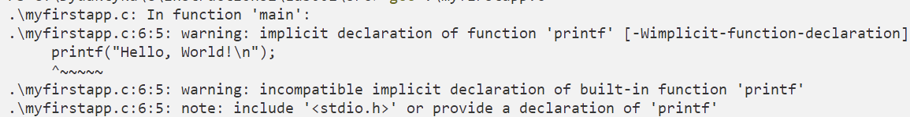

Skompilowany program można uruchomić na dwa sposoby. Pierwszy to otworzenie folderu i uruchomienie programu poprzez dwukrotne kliknięcie w ikonę. Drugie to uruchomie programu w terminalu. Domyślnie VSCode zabrania uruchamiania plików bez podania ścieżki względnej do obecnego folderu ".\". Zatem program można uruchomić komendą: `.\[ścieżka do programu].exe` 

### Zadanie 2

Skompiluj program `myfirstapp.c` do pliku `myfirstapp.exe`. Następnie uruchom program.

## Wypisywanie tekstu w standarwodym wyjściu

**Analiza działania programu**

Dyrektywa #include w języku C służy do dołączania plików nagłówkowych do programu. Podczas kompilacji **Linker odszukuje w plikach nagłówkowych implementację funkcji zdefiniowanych w plikach z rozszerzeniem ".h" i "wkleja" w wyznaczone miejsce aby utworzyć plik który finalnie będzie kompilowany**. Linker może optymalizować kod np. przez eliminowanie nieużywanych funkcji lub zmiennych.

```c
#include <stdio.h>
#include <stdlib.h>
```

**Funkcja `main()` jest punktem startowym w programie.** Wewnątrz niej w bloku oznaczonym znakami "{}" będą zawarte instrukcje dla komputera np. deklaracja zmiennej czy wywołanie funkcji wypisującej tekst na ekranie. **`int` przed nazwą funkcji oznacza że dana funkcja zwraca wartość całkowitą**. **Z funkcji wartość zwracamy za pomocą instrukcji `return [wartość zwracana];`**. Funkcja `main()` która zwraca wartość **0 oznacza "Fałsz" - działanie programu przebiegło pomyślnie** i nie wystąpił żaden problem. **Wartośći inne niż 0 będą oznaczać "Prawda" a więc podcza działania napotkano problem**.
```c
int main()
{return 0;}
```

Pierwszą instrukcją w bloku funkcji `main()` jest funkcja `printf()` z biblioteki **`stdio.h`(Standard Input Output)**. Funkcja ta ma następującą postać w dokumentacji:

`int printf(const char *format, ...);`

- `int` oznacza że funkcja zwraca liczbę całkowitą. Liczba ta będzie ilością znaków wypisanych na standardowym wyjściu(w konsoli). Jeśli nie uda się wypisać znaków zwracana jest liczba ujemna.
- `const char *format` wskaźnik na łańcuch znaków który ma zostać wypisany w konsoli. W owym łańcuchu funkcja będzie szukać kombinacji znaków w postaci `%[litera]` w których miejsce będą podstawiane wartości przekazane do funkcji.
- ` ...` oznacza że do funkcji możemy przekazać nieskończoną liczbę wartości. Należy pamiętać że ilość wartośći przekazanych do funkcji powinna odpowiadać ilości wystąpień `%[litera]` w formatce(pierwszy z argumentów funckji).

Zatem linia w programie:

```c
printf("Hello, World!\n");
```

Wypisze na standardowym wyjściu napis "Hello, World!" a następnie przejdzie do nowej linni. Przejście do nowej linii zdefiniowane jest przez znak "\n" na końcu łańcucha znaków. Inne znaki specjalne które mogą wystąpić w łańcuchach znaków:

- **`\n`: Nowa linia.** Przechodzi do następnego wiersza.
- **`\t`: Tabulator.** Dodaje odstęp w postaci tabulatora.
- **`\"`: Podwójny cudzysłów.** Używany do umieszczania podwójnych cudzysłowów w ciągach znaków.
- **`\'`: Pojedynczy cudzysłów.** Używany do umieszczania pojedynczych cudzysłowów w ciągach znaków.
- **`\\`: Ukośnik wsteczny.** Używany do umieszczania ukośników w ciągach znaków.
- `\b`: Backspace (cofnij kursor). Powoduje przesunięcie kursora do tyłu o jedną pozycję.
- `\r`: Powrót karetki. Powoduje przesunięcie kursora na początek wiersza.
- `\f`: Nowa strona. Powoduje przesunięcie kursora na nową stronę.
- `\v`: Pionowa tabulacja. Powoduje przesunięcie kursora o jedną pozycję w pionie. **Obecnie w większości edytorów ma takie samo działanie jak `\n`.**
- **`\0`: Null-terminator. Reprezentuje znak końca łańcucha znaków (o kodzie ASCII 0).**
- `\xhh`: Znak o określonym kodzie szesnastkowym. Na przykład, \x0A reprezentuje znak nowej linii.

Funkcja `system()` jest zawarta w bibliotece `<stdlib.h>` i służy do wywołania poleceń powłoki systemowej np. polecenia `gcc` (np. `system("gcc program.c -o program.exe");`). Przekazanie do funkcji łańcucha znaków "PAUSE" wypisze w standardowym wyjściu napis "Press any key to continue ..." i wstrzyma działanie programu do momentu wciśnięcia dowolnego klawisza. Po wciśnięciu działanie programu zostanie wznowione i wykonają się kolejne instrukcje.

```c
system("PAUSE");
```

Ostatnia linia zwraca wartość 0. EXIT_SUCCESS jest to stała przechowująca wartość 0. Aby sprawdzić wartość jaką przechowuje w VSCode należy najechać na zmienną po czym pojawi się dymek z dokumentacją.

```c
return EXIT_SUCCESS;
```

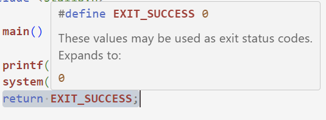

### Zadanie 3

Utwórz program `print.exe` który wypisuje w konsoli następujący napis:

```
C:\Users\Admin\>dir
 Volume in drive C is OS
 Volume Serial Number is ABCD-1234

 Directory of C:\Users\Admin
 
2023-10-10  15:30    <DIR>          .
2023-10-10  15:30    <DIR>          ..
2023-10-10  15:30               345 Plik1.txt
2023-10-10  15:31               789 Plik2.txt
2023-10-10  15:32             1,234 Plik3.txt
                3 File(s)          2,368 bytes
                2 Dir(s)  123,456,789,012 bytes free
```

### Zadanie 4

Komenda powłoki systemowej `cls` czyści okno konsoli w systemach Windows. Funkcja `system()` może wywoływać polecenia powłoki. Napisz program który:

1. wyczyści okno terminala
2. Wypisze na ekranie:

```
 Hello World!
 Press any key to continue ...
```

3. Po wciśnięciu klawisza podmieni napis World na twoje imię. i nazwisko. W konsoli będzie widoczny tylko:

```
 Hello Jan Kolwaski!
 Press any key to continue ...
```

## Zmienne

Zmienna w języku C to symboliczna nazwa, która jest używana do przechowywania danych o określonym typie. Zmienne tworzymy w następujący sposób `[typ] [alias];` gdzie:

- [typ] to jeden z typów zdefiniowanych w języku C. Podstawowe typy to:

```c
#include <stdio.h>
#include <stdlib.h>

int main()
{ 
    // to jest komentarz. Nie wpływa on na działanie programu.
    int integerVariable; // liczba całkowita
    float floatingPointNumber; // liczba zmiennoprzecinkowa
    char charVariable; // znak
    double doublePrecisionFloatingPointNumber; // liczba zmiennoprzecinkowa o podwójnej precyzji
}
```

Aby wypisać wartość przechowaywaną przez zmienną można wykorzystać funkcję `printf()`. Poniżej przykład wypisujący wartość zmiennych różnych typów. Zauważ że wartość przechowywana przez zmienną zostaje podstawiona w miejsce `%[litera]`.

```c
#include <stdio.h>
#include <stdlib.h>

int main()
{
    int integerVariable;
    float floatingPointNumber;
    char charVariable;
    double doublePrecisionFloatingPointNumber;

    printf("Liczba calkowita %i \n", integerVariable);
    printf("Liczba zmiennoprzecinkowa %.2f \n", floatingPointNumber); // .2 oznacza że zostaną wyświetlone 2 znaki po przecinku.
    // możemy wypisać wszystko za pomocą jednego wywołania funkcji printf(). Za %c zostanie podstawiony znak a za %lf
    printf("Znak %c \nLiczba zmiennoprzecinkowa o podwojnej precyzji %lf\n", charVariable, doublePrecisionFloatingPointNumber);
}
```

Powyższe programy przy każdym uruchomieniu będą wypisywać różne wartości. Dzieje się tak ponieważ przy **deklaracji** jej wartość będzie taka jak w danej chwili były ustawione bity w pamięci komputera. Współczesne kompilatory potrafią wyzerować wartość przy deklarowaniu zmiennej tak aby miała wartość 0. Aby przypisać do zmiennej wartość używa się operatora przypisania `=`. Jeśli użyjemy operatora przypisania przy deklaracji zmiennej, nazywamy to **inicjalizacją** (przypisanie początkowej wartośći).
**Zainicjalizować lub zadeklarować zmienną o tej samej nazwie, w tym samym zakresie dostępności zmiennej możemy tylko raz.**

```c
#include <stdio.h>
#include <stdlib.h>

int main()
{
    // inicjalizacja zmiennych różnych typów
    int integerVariable = 1234;
    float floatingPointNumber = 4.15;
    char charVariable = 'y';
    double doublePrecisionFloatingPointNumber = 4.123;

    //deklaracja zmiennych
    int a;
    float b;
    char c;
    double d; 
}
```

W czasie działania programu wartośći przechowywane przez **zmienne możemy modyfikować wielokrotnie używając nazwy danej zmiennej oraz operatora przypisania `=`**. 

```c
#include <stdio.h>
#include <stdlib.h>

int main()
{
    int var1 = 1234;
    printf("Zmienna przed modyfikacja: %i\n", var1);

    var1 = 4321;
    printf("Zmienna po modyfikacji: %i\n", var1);


    var1 = 44;
    printf("Zmienna po kolejnej modyfikacji: %i\n", var1);
}
```

**Konwencja nazewnictwa zmiennych**
- Nazwy zmiennych powinny być opisowe i odzwierciedlać ich przeznaczenie. np. `height` zamiast `x`
- Użyj notacji camelCase w której pierwsze słowo zaczyna się małą literą, a każde kolejne słowo z wielkiej. np. `numberOfElements`.
- Nie nadawaj zmiennym nazw, które są słowami zarezerwowanymi w języku C (np. int, while, for, itp.).
- Używaj nazw zmiennych w języku angielskim.

Niekiedy istnieje potrzeba utworzenia zmiennej której wartość raz przypisana nie może ulec zmianie. Takie zmienne nazywamy **stałymi**. Konwencja nazewnictwa stałych nakazuje aby nazwa była zapisana wielkimi literami, a kolejne słowa tworzące nazwę aby były oddzielane znakiem "_". Aby zadeklarować stałą w programie należy użyć słówka kluczowego `const` przed typem zmiennej. np.

```c
#include <stdio.h>
#include <stdlib.h>

int main()
{
    const int LIGHT_SPEED = 299792458;

    // Próba modyfikacji stałej spowoduje błąd kompilacji
    // LIGHT_SPEED = 299792458000000;
}
```

### Zadanie 5

Utwórz program koledzy.exe który przechowuje w następujących zmiennych:
- `name` - twoje imię
- `surname` - twoje nazwisko
- `age` - twój wiek
- `albumNumber` - twój numer albumu
- `PI_VALUE` - wartość liczby pi(stała wartość - constant)

Następnie program wypisuje w standardowym wyjściu te informacje.
Zmień wartości zmiennych `name`, `surname`, `age` oraz `album number` na wartości odpowiadające danym kolegi siedzącego po prawej stronie. Następnie wypisz te dane w konsoli.

Zmodyfikuj kolejny raz wartości zmiennych `name`, `surname`, `age` oraz `album number` na wartości odpowiadające danym kolegi siedzącego po lewej stronie. Następnie wypisz te dane w konsoli.

Przykładowe wyjście:
```
Student:
Jan Kolwalski lat: 20 nr. albumu: 1234567

Prawa strona:
Jan Baran lat: 20 nr. albumu: 1234568

Lewa strona:
Jakub Baran lat: 20 nr. albumu: 1271830
```

## Biblioteka <limits.h>

Biblioteka `<limits.h>` jest częścią standardowej biblioteki języka C i zawiera zestaw **stałych** związanych z ograniczeniami typów danych całkowitych, takich jak int, long, short, itp. W limits.h znajdziesz stałe, które określają zakresy wartości tych typów, a także inne charakterystyki. Zakresy te mogą się różnić w zależności od systemu operacyjnego czy kompilatora.
Poniżej przykład wypisujący maksymalną i minimalną wartość dla typu `int`.

```c
#include <stdlib.h>
#include <stdio.h>
#include <limits.h>
int main(int argc, char const *argv[])
{
    // Typy całkowite
    puts("Integer");
    int maximumValue = INT_MAX;    // Biblioteka limits.h zawiera stałe np INT_MAX zawierające maksymalną wartość typu int
    signed minimumValue = INT_MIN; // Słówko kluczowe signed definiuje że typ może przechowywać dodatnie i ujemne wartości.
    printf("Wartosc w systemie | minimalna: %i \t\tmaksymalna %i\n", maximumValue, minimumValue);
    printf("Standard C         | minimalna: %i \t\tmaksymalna %i\n", -32767, 32767);
}
```

Limity zmiennych wymuszone przez standard można znaleźć w dokumencie opisującym standard: https://www.open-std.org/jtc1/sc22/wg14/www/docs/n2310.pdf

W rozdziale `5.2.4.2 Numerical limits` opisano limity dla typów liczbowych.

### Zadanie 6

Utwórz program `limityzmiennych.exe` w którym wypiszesz wszystkie zakresy typów zmiennych w systemie oraz według standardu.

Dla niektórych z typów aby poprawnie wypisać ich wartości potrzebne będzie skorzystanie z dokumentacji funkcji `printf()` której opis znajduje się pod adresem https://pl.wikibooks.org/wiki/C/printf

Przykładowo aby wypisać typ `long int` według dokumentacji 


oraz 

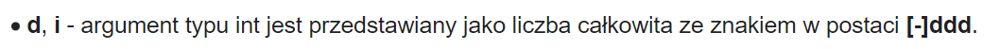

Zatem aby wypisać wartość zmiennej typu `long int` należy użyć formatki w postaci `%li`.


