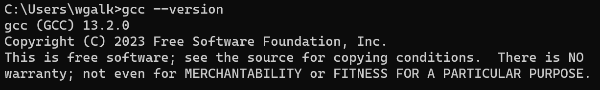
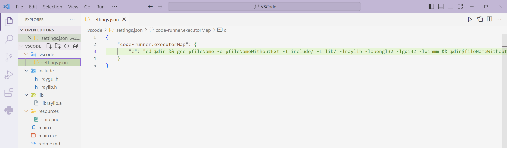
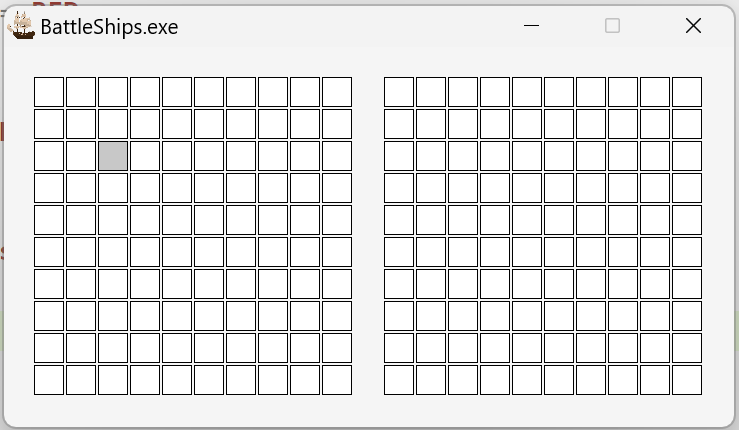

# PPWJC

## Konfigruacja środowiska

Pobeirz i zainstaluj środowisko MinGW w wersji 13. 
https://raysan5.itch.io/raylib/download/eyJleHBpcmVzIjoxNzA0NjY4NzA2LCJpZCI6ODUzMzF9.wSQM8OQhU4Q7z9XN4DFfgE3xvIM%3d

https://c.lazysolutions.pl/instructions2/Lab007/mingw.zip

Znajdź zainstalowane narzędzie i dodaj do zmiennych środowiskowych folder:
```
w64devkit\bin
```

Sprawdź czy narzędzie działa wpisując w konsoli:

```
gcc --version
```


Pobierz archiwum zawierające strukturę projektu i otwórz w Visual Studio Code: https://c.lazysolutions.pl/instructions2/Lab007/VSCode.zip

W pliku settings.json znajduje się konfiguracja CodeRunner tak aby podczas kompilacji programu wykorzystana była bibloiteka raylib.


Powyższa konfiguracja będzie uruchamiać narzędzie gcc w sposób podobny do poniższego:

```
gcc window.c -o window.exe -I include/ -L lib/ -lraylib -lopengl32 -lgdi32 -lwinmm
```

## Zadanie 1

Przeanalizuj działanie programu main.c w pobranym projekcie. Dodaj komentarze objaśniające co może wykonywać dana linia/fragment w kodu.

## Zadanie 2

Zmodyfikuj funkcje drawBoard:

```c
void drawBoard()
{
    BeginDrawing();
    ClearBackground(RAYWHITE);

    Rectangle rec = {0, 0, 30, 30};
    DrawRectangleRec(rec, (Color){200, 200, 200, 255});

    if (CheckCollisionPointRec(GetMousePosition(), rec))
    {
        DrawRectangleRec(rec, (Color){255, 200, 200, 255});
    }

    DrawRectangleLinesEx(rec, 1, BLACK); // Draw cell border

    EndDrawing();
}
```

Przeanalizuj podany fragment kodu. Zmień wartości pól struktury rec typu Rectangle. Co robią poszczególne wartości?

Zmień wartości pól struktury Color. Co robią poszczególne wartości?

## Zadanie 3

Funkcja CheckCollisionPointRec() sprawdza czy kursor myszy znajduje się nad kwadratem.

Zmodyfikuj funkcję drawBoard tak aby po uruchomieniu programu wyświetlała się poniższa plansza, gdzie po najechaniu na dany kwadrat zmienia on kolor z białego na szary:


## Zadanie 4

W strukturze Game pole boardPlayer1 przechowuje planszę gracza 1 a pole Player1Shoots przechowuje strzały gracza1. Zmodyfikuj program z poprzedniego zadania tak aby po lewej stronie plansza była wyświetlana na podstawie stanu pól w tablicy boardPlayer1 a po prawej plansza była wyświetlana na podstawie wartości z tablicy Player1Shoots.

Jeśli:
- EMPTY pole ma kolor biały
- SINGLE_DECKER, DOUBLE_DECKER, TRIPPLE_DECKER, FOUR_DECKER, pole ma kolor czarny.
- SHOOTED pole ma kolor czerwony
- MARKED pole ma kolor żółty


